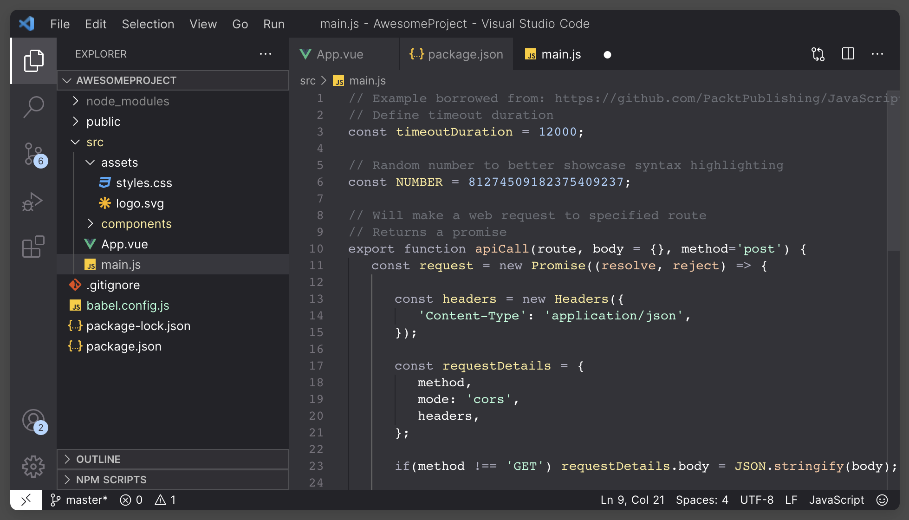

  

<h1 align="center">
  Steel Phantom Theme for VsCode
</h1>

  A minimal dark theme for VsCode.
   
  Built with ❤️ by <a href="https://github.com/davidcmass">DavidMass</a>

## VsCode Installation

1. Open the Extensions sidebar panel in Visual Studio Code by navigating to View → Extensions.
2. In the search bar, type "Steel Phantom" to find the desired extension.
3. Click on the "Install" button to initiate the installation process.
4. After the installation is complete, click on "Reload" to refresh the editor.
5. Go to Code → Preferences → Color Theme and select "Steel Phantom" as the desired color theme.

## Colour Reference

| Colour                                                   | Hex     |
| -------------------------------------------------------- | ------- |
|  | #26282c |
|  | #333338 |
|  | #5b6068 |
|  | #b0b0c2 |
|  | #ffffff |
|  | #b1d7ff |
|  | #ffed9d |
|  | #adffd9 |
